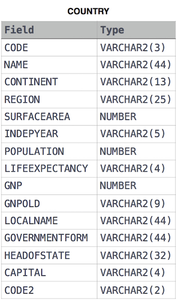

iven the CITY and COUNTRY tables, query the names of all cities where the CONTINENT is 'Africa'.

Note: CITY.CountryCode and COUNTRY.Code are matching key columns.

Input Format

The CITY and COUNTRY tables are described as follows:

SELECT SUM(Ct.POPULATION) \
FROM CITY Ct \
INNER JOIN COUNTRY Co \
ON Ct.COUNTRYCODE = Co.CODE \
WHERE Co.CONTINENT = 'Asia';