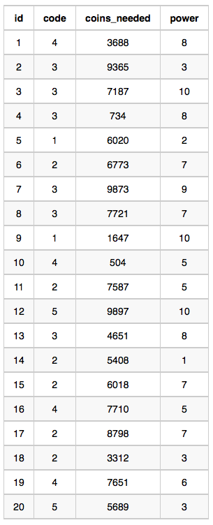

Harry Potter and his friends are at Ollivander's with Ron, finally replacing Charlie's old broken wand.

Hermione decides the best way to choose is by determining the minimum number of gold galleons needed to buy each non-evil wand of high power and age. \
Write a query to print the id, age, coins_needed, and power of the wands that Ron's interested in, sorted in order of descending power. If more than one wand has same power, sort the result in order of descending age

The following tables contain data on the wands in Ollivander's inventory:

Wands: The id is the id of the wand, code is the code of the wand, coins_needed is the total number of gold galleons needed to buy the wand, and power denotes the quality of the wand (the higher the power, the better the wand is). 

Wands_Property: The code is the code of the wand, age is the age of the wand, and is_evil denotes whether the wand is good for the dark arts. If the value of is_evil is 0, it means that the wand is not evil. The mapping between code and age is one-one, meaning that if there are two pairs, (code1, age1) and (code2, age2)
then code1 != code2 and age1 != age2

Sample Input

Wands Table:

Wands_Property Table:

SELECT W.id, P.age, W.coins_needed, W.power \
FROM Wands W \
JOIN Wands_Property P \
ON W.code = P.code \
WHERE W.coins_needed = \
&nbsp;&nbsp;&nbsp;&nbsp;&nbsp;&nbsp;&nbsp;&nbsp;&nbsp;&nbsp;&nbsp;&nbsp;(SELECT MIN(coins_needed) \
 &nbsp;&nbsp;&nbsp;&nbsp;&nbsp;&nbsp;&nbsp;&nbsp;&nbsp;&nbsp;&nbsp;&nbsp;                       FROM Wands w2 
                        JOIN Wands_Property p2 \
&nbsp;&nbsp;&nbsp;&nbsp;&nbsp;&nbsp;&nbsp;&nbsp;&nbsp;&nbsp;&nbsp;&nbsp;
                        ON w2.code = p2.code \
&nbsp;&nbsp;&nbsp;&nbsp;&nbsp;&nbsp;&nbsp;&nbsp;&nbsp;&nbsp;&nbsp;&nbsp;
                        WHERE p2.is_evil = 0 \
&nbsp;&nbsp;&nbsp;&nbsp;&nbsp;&nbsp;&nbsp;&nbsp;&nbsp;&nbsp;&nbsp;&nbsp;
                        AND p2.age  = P.age \
&nbsp;&nbsp;&nbsp;&nbsp;&nbsp;&nbsp;&nbsp;&nbsp;&nbsp;&nbsp;&nbsp;&nbsp;
                        AND w2.power = W.power) \
ORDER BY W.power desc, P.age desc;