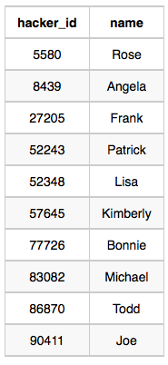
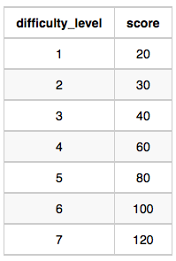
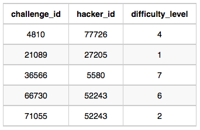
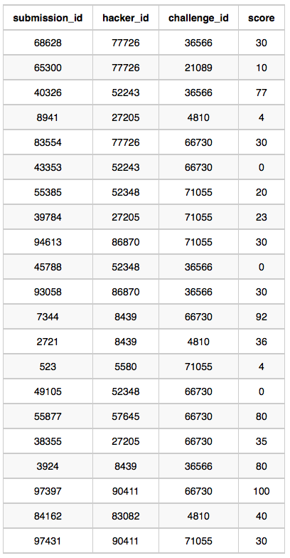

Julia just finished conducting a coding contest, and she needs your help assembling the leaderboard! Write a query to print the respective hacker_id and name of hackers who achieved full scores for more than one challenge. Order your output in descending order by the total number of challenges in which the hacker earned a full score. If more than one hacker received full scores in same number of challenges, then sort them by ascending hacker_id.

Hackers Table: 
Difficulty Table:  \
Challenges Table:  \
Submissions Table:   

SELECT H.hacker_id, H.name \
FROM Submissions S \
JOIN Hackers H \
&nbsp;&nbsp;&nbsp;&nbsp;&nbsp;&nbsp;  ON S.hacker_id = H.hacker_id \
JOIN Challenges C \
&nbsp;&nbsp;&nbsp;&nbsp;&nbsp;&nbsp;  ON S.challenge_id = C.challenge_id \
JOIN Difficulty D \
ON C.difficulty_level = D.difficulty_level\
WHERE S.score = D.score\
GROUP BY H.hacker_id, H.name\
HAVING COUNT(H.hacker_id) > 1\
ORDER BY COUNT(*) desc, H.hacker_id;