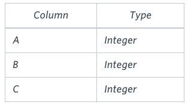
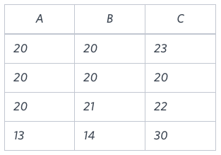

Write a query identifying the type of each record in 
the TRIANGLES table using its three side lengths. Output one of the following statements for each record in the table:

Equilateral: It's a triangle with  sides of equal length.
Isosceles: It's a triangle with  sides of equal length.
Scalene: It's a triangle with  sides of differing lengths.
Not A Triangle: The given values of A, B, and C don't form a triangle.
Input Format

The TRIANGLES table is described as follows:

Each row in the table denotes the lengths of each of a triangle's three sides.

Sample Input

Sample Output

Isosceles
Equilateral
Scalene
Not A Triangle
Explanation

Values in the tuple (20,20,23)  form an Isosceles triangle, because A == B
Values in the tuple (20,20,20) form an Equilateral triangle, because . Values in the tuple  form a Scalene triangle, because .
Values in the tuple  cannot form a triangle because the combined value of sides  and  is not

Solution:

SELECT \
    CASE \
        WHEN (A+B) <= C OR (A+C) <= B OR (B+C) <= A THEN 'Not A Triangle'  
        /* Need to run the more computational step first to avoid mislabelling */ \
        WHEN A = B AND B = C THEN 'Equilateral' \
        WHEN A = B OR B = C OR A = C THEN 'Isosceles' \
        ELSE 'Scalene' \
    END AS Triangle_type \
    FROM TRIANGLES;